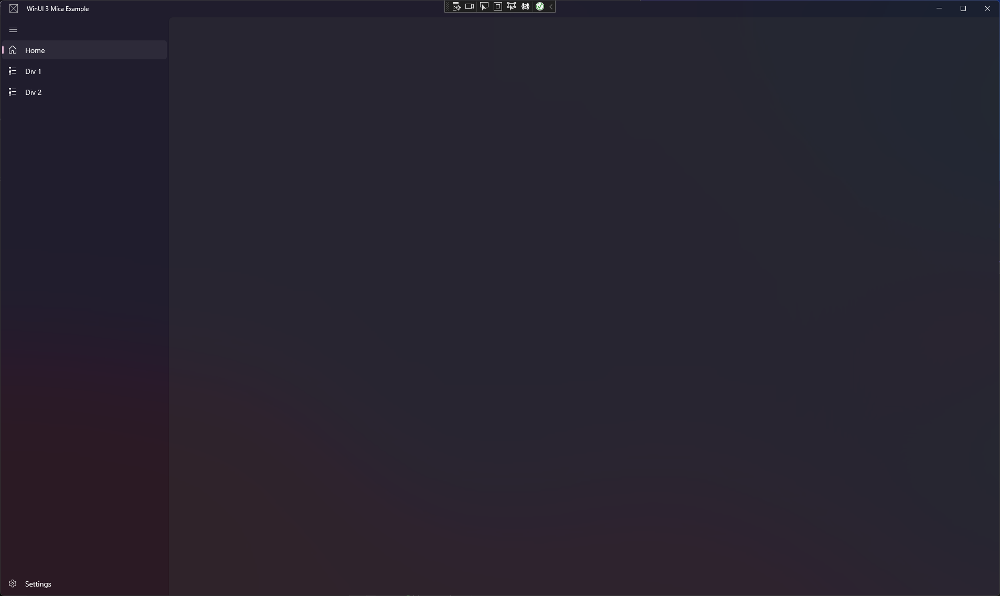
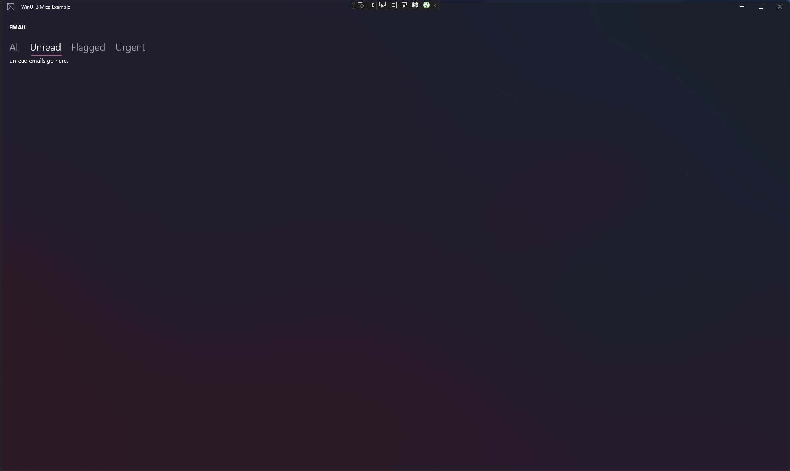

# WinUI 3 Mica Template

This template is a starting point for a WinUI 3 app that uses the Mica brush.

By default the nav control is NavigationView, but you can change it to any other control.

## Screenshots

| NavigationView | Pivot | BreadCrumBar |
|-------------------------|-------------------------|-------------------------|
 |  | 

## Issues
- Nav controls like TaView are usually over the TitleBar, but that is not possible with the actual configuration.
- Other elements like the default Back Button from NavigationView can not be shown in the TitleBar.

If you have any idea how to solve this, please let me know.